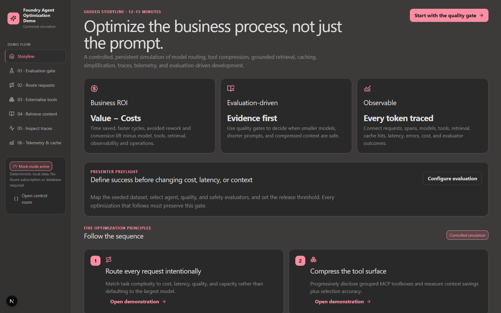
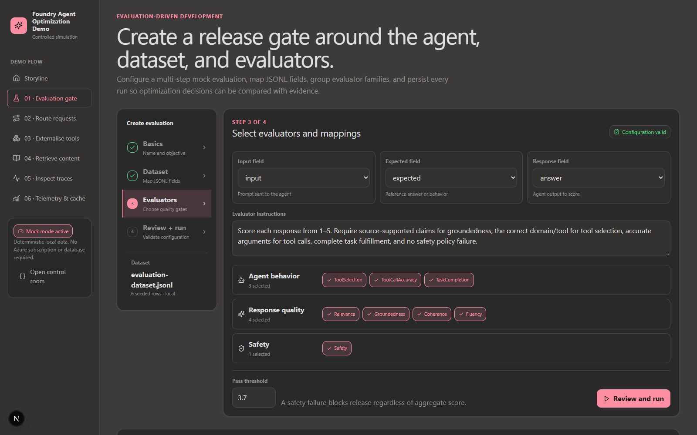
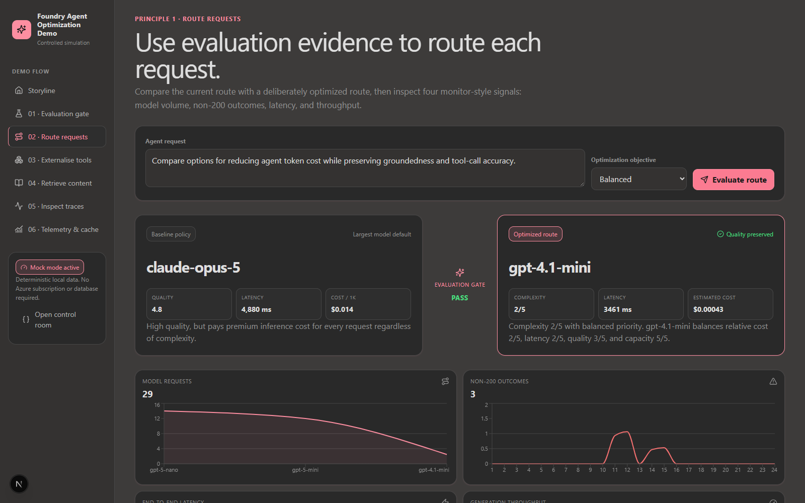
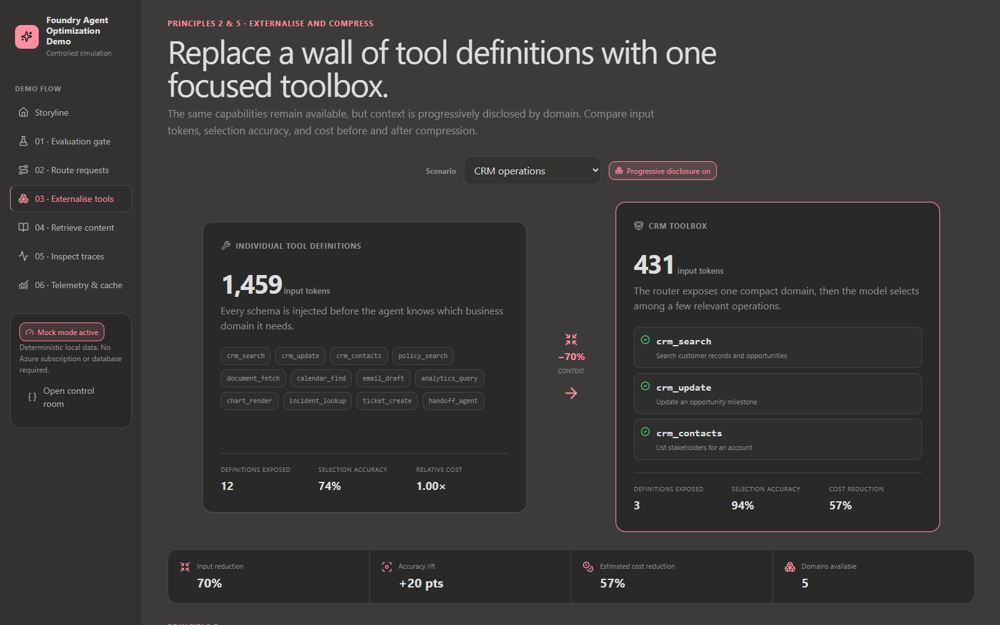
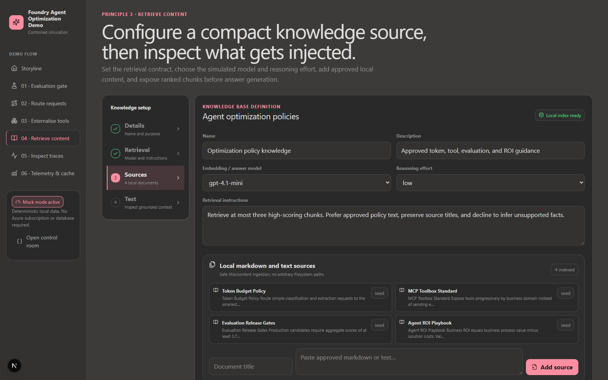
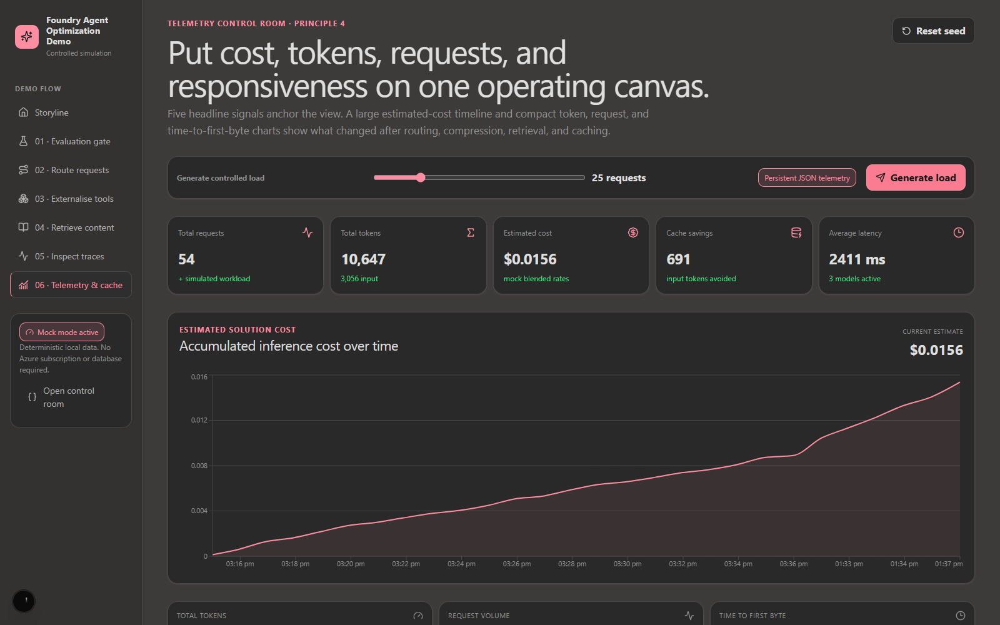
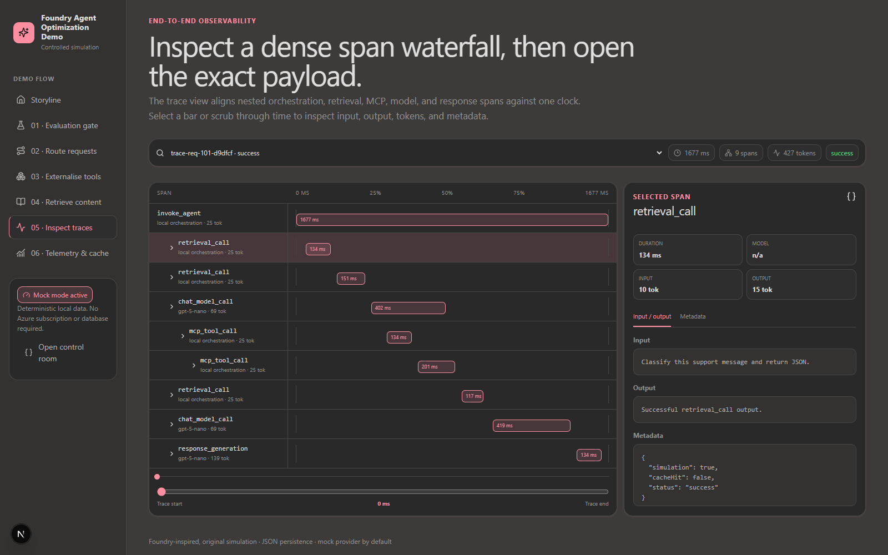

# Portal-first Foundry Agent Optimization Demo

A portal-first Microsoft Foundry walkthrough for model routing, MCP/toolbox compression, grounded retrieval, caching, tracing, telemetry, and evaluation-driven development.

The live presentation starts in the Microsoft Foundry portal. The included Next.js application is a companion workload generator and visualization surface: it creates repeatable requests, exposes optimization comparisons, and provides a deterministic fallback when tenant access or conference connectivity is unavailable.

The repository supports two modes:

- **Direct Foundry demo:** tenant-owned Foundry resource and project, real model deployments, a runnable prompt agent, Application Insights, Log Analytics, and managed identity. Present and run the agent in the Foundry portal.
- **Foundry + companion app demo:** the same Foundry deployment plus a local or App Service-hosted workload generator and visualization surface.
- **Mock fallback:** local and deterministic, with no Azure resources or credentials.



## Canonical portal-first storyline

Use this order for every city and presenter. Keep the Foundry project open as the primary screen and move to the companion app only when the walkthrough needs to generate traffic or make an optimization comparison visible.

| Stage | Foundry portal walkthrough | Companion app role |
|---|---|---|
| **Project orientation** | Open the deployed Foundry project and identify the project endpoint, connected Application Insights resource, and managed identity. | Keep `/` available as the business ROI and optimization-loop visual. |
| **Models and deployments** | Open the model deployment list and compare the deployed `gpt-5-mini`, `gpt-5-nano`, and `gpt-4.1-mini` capacity available to the agent. | Use `/route-requests` later to generate requests with different cost, latency, and quality priorities. |
| **Agent configuration** | Open `foundry-optimization-agent`, review its model, instructions, and available tools, then run a baseline prompt in the portal playground. | Use the app only to show before/after context and routing comparisons that are difficult to explain from one portal run. |
| **Evaluation gate** | Create or open an evaluation in Foundry, map the dataset, select quality, task, tool, and safety evaluators, and establish the release threshold before optimizing. | `/evaluations` is the deterministic rehearsal and offline fallback for the same gate. |
| **Generate optimized traffic** | Keep the portal open while submitting controlled real requests through the deployed app or load script. | `/route-requests` and `npm run azure:load -- --execute` generate repeatable tenant traffic. |
| **Tracing** | Open the agent's traces in Foundry, locate a generated trace ID, and inspect orchestration, model, retrieval, and tool spans. | `/traces` explains the span anatomy and remains the no-network fallback. |
| **Monitoring and spend** | Review Foundry/Application Insights monitoring for request volume, latency, failures, and token usage; use Azure Cost Management for authoritative spend. | `/telemetry` provides an immediate optimization comparison using illustrative cost estimates. |
| **Context, retrieval, and caching** | Relate the observed signals back to prompt instructions, tools, knowledge, and production caching architecture. Configure tenant features in Foundry when available. | `/toolboxes`, `/knowledge`, and `/telemetry` make token and context trade-offs visible; they do not claim to provision Foundry IQ or APIM/Redis. |
| **Close the loop** | Return to the Foundry evaluation and monitoring views: **evaluate → change → generate traffic → trace → monitor → evaluate again**. | Use `/` only as the closing summary visual. |

See [`docs/FOUNDRY-PORTAL-WALKTHROUGH.md`](docs/FOUNDRY-PORTAL-WALKTHROUGH.md) for the detailed portal navigation and [`docs/DEMO-RUNBOOK.md`](docs/DEMO-RUNBOOK.md) for the timed presenter script.

## Quick setup: local rehearsal

```powershell
git clone https://github.com/saanviyerawar/foundry-token-optimization-demo.git
cd foundry-token-optimization-demo
npm install
npm run reset
npm run dev
```

Open `http://localhost:3000?clawpilotTheme=dark`.

This deterministic mode is the recommended rehearsal and fallback. It demonstrates the optimization concepts, but it is not the canonical portal-first presentation.

## Choose a deployment path

> **Cost warning:** the deployment creates billable model capacity and Application Insights/Log Analytics. App Service is optional. Confirm regional model availability, quota, policy, and pricing before deployment.

### Prerequisites

- Node.js 22+
- Azure CLI
- Azure Developer CLI (`azd`) 1.29+
- An Azure subscription where you can create resource groups and role assignments. Owner is simplest for a demo; Contributor alone cannot create RBAC assignments.
- Permission to deploy the selected Foundry models in the chosen region.

Confirm the intended tenant and subscription before creating anything:

```powershell
azd auth login
az login
az account show --query "{subscription:name, tenant:tenantId}" --output table
```

### Option A: direct Foundry portal demo

```powershell
git clone https://github.com/saanviyerawar/foundry-token-optimization-demo.git
cd foundry-token-optimization-demo
npm install
npm run azure:deploy -- -EnvironmentName demo -Location eastus2
```

The wrapper authenticates with `azd`, creates/selects the environment, provisions the Foundry project and model deployments, creates or updates `foundry-optimization-agent`, writes non-secret local settings to `.env.local`, and prints the Foundry portal handoff. The default command does not deploy App Service.

Equivalent direct portal-first path:

```powershell
azd auth login
azd env new demo --location eastus2
azd provision
```

After provisioning, open `https://ai.azure.com`, select the printed project name, open `foundry-optimization-agent`, and run it in the agent playground.

### Option B: Foundry plus hosted companion app

Provision the same runnable Foundry demo and deploy the companion to App Service:

```powershell
npm run azure:deploy:companion -- -EnvironmentName demo -Location eastus2
```

### Option C: Foundry plus local companion app

Start with Option A, then run the companion locally against the deployed Foundry agent:

```powershell
npm run azure:env
npm run reset
npm run dev
```

Open the Foundry portal as the primary presentation window. Open `http://localhost:3000?clawpilotTheme=dark`, or the optional `AZURE_WEB_APP_URI`, in a second window only for controlled workload generation and supporting visuals.

### Pre-demo checks

1. Open the Foundry project and confirm the model deployments, prompt agent, and Application Insights connection.
2. Run a baseline prompt from the agent playground.
3. Prepare or verify the Foundry evaluation and record its baseline result.
4. Submit one real routed request from the companion app and copy its trace ID.
5. Confirm the trace appears in Foundry or Application Insights; ingestion can take several minutes.
6. Run only the controlled load needed for visible monitoring signals.
7. Open every companion route once and keep mock mode ready as the no-network fallback.

See [`docs/AZURE-DEPLOYMENT.md`](docs/AZURE-DEPLOYMENT.md) for tenant roles, model customization, validation, traces, troubleshooting, optional model router, and teardown.

## Companion app screen references

These screenshots document the supporting application, not the primary presentation path. Portal screenshots are intentionally not committed because they commonly contain tenant, subscription, resource, trace, or prompt details.

### Tokenomics, ROI, and evaluation-driven development




### Five design principles

**1. Model routing**



**2. Optimize/compress context and 5. Simplify**



The lower section of the live page compares a bloated system prompt with a concise one and shows which content moves to toolboxes and retrieval.

**3. Retrieval**



**4. Caching**



### Telemetry, Foundry agent tracing, and spend




## What the default deployment automates

- Resource group
- `Microsoft.CognitiveServices/accounts` with `kind: AIServices`
- Foundry project child resource with managed identity
- Configurable direct model deployments for `gpt-5-mini`, `gpt-5-nano`, and `gpt-4.1-mini`
- Log Analytics workspace and workspace-based Application Insights
- Foundry account/project Application Insights connections for agent tracing
- Foundry User role assignments for the project identity, presenter identity when available, and web-app identity
- Runnable `foundry-optimization-agent` for the Foundry agent playground
- Optional Linux App Service and plan when `-DeployCompanionApp` is supplied
- Real runtime settings using managed identity and the Foundry project endpoint
- Idempotent prompt-agent creation/update

## Deliberately not claimed as automated

- **Foundry IQ knowledge source:** not provisioned. The app’s knowledge lab remains a transparent local BM25-like implementation. Configure Foundry IQ manually if your tenant has access.
- **APIM semantic caching or Azure Managed Redis:** not provisioned. The cache page demonstrates the economics and behavior; it does not claim a managed semantic cache exists.
- **Claude deployment:** not provisioned by default because regional availability, marketplace terms, and routing policy vary. The logical `claude-opus-5` route maps to `gpt-5-mini` until you configure an approved deployment.
- **Model router:** supported through a preview management API and therefore disabled by default. Enable it explicitly or use `npm run azure:router`.
- **Private networking, CMK, APIM, Redis, and Foundry IQ:** optional production architecture work, not hidden defaults.

## Runtime provider

`lib/provider.ts` implements:

- `MockProvider`
- `FoundryProvider` using `AIProjectClient`, the project Responses API, and `DefaultAzureCredential`
- `AzureOpenAIProvider` using Microsoft Entra ID by default, with an API-key fallback only when explicitly configured

Logical model IDs map to deployment names through server-only environment variables. Secrets are never sent to client components. Real API failures return explicit 502 responses rather than simulated success.

## Architecture

```text
Next.js App Router
  ├─ Interactive demo pages and local JSON telemetry
  ├─ /api/requests -> mock or real Foundry provider
  ├─ OpenTelemetry -> Application Insights when configured
  └─ Atomic JSON persistence (data/ locally, /home/data on App Service)

azd + Bicep
  ├─ Foundry AIServices account + project
  ├─ Direct model deployments
  ├─ Optional preview model router
  ├─ Application Insights + Log Analytics + project connections
  ├─ Least-scope Foundry/monitoring RBAC
  └─ Optional App Service deployment, disabled by default
```

Important paths:

- `azure.yaml`: azd application and lifecycle hooks.
- `infra/main.bicep`, `infra/resources.bicep`: tenant infrastructure.
- `scripts/deploy.ps1`: presenter deployment wrapper.
- `scripts/create-agent.ts`: idempotent Foundry prompt-agent setup.
- `scripts/load-real.ts`: guarded real traffic generation.
- `lib/provider.ts`: real/mock provider abstraction.
- `lib/azure-monitor.ts`: server-only, lazy Azure Monitor OpenTelemetry initialization before real calls.
- `docs/DEMO-RUNBOOK.md`: presenter sequence.
- `docs/FOUNDRY-PORTAL-WALKTHROUGH.md`: canonical portal navigation and handoffs to the companion app.
- `docs/SCREENSHOT-GUIDE.md`: reproducible visual states.

## Validation

```powershell
npm run azure:validate
az bicep lint --file infra/main.bicep
az bicep build --file infra/main.bicep
npm test
npm run lint
npm run build
```

CI runs all credential-free checks. A tenant what-if is intentionally separate because it needs Azure authentication and a target subscription.

## Official Microsoft references

- [Deploy a Foundry resource with Bicep](https://learn.microsoft.com/azure/foundry/how-to/create-resource-template)
- [Official Foundry Bicep samples](https://github.com/microsoft-foundry/foundry-samples/tree/main/infrastructure/infrastructure-setup-bicep)
- [Foundry SDKs and project endpoints](https://learn.microsoft.com/azure/foundry/how-to/develop/sdk-overview)
- [Create a prompt agent with the TypeScript SDK](https://learn.microsoft.com/azure/foundry/agents/quickstarts/prompt-agent)
- [Foundry role-based access control](https://learn.microsoft.com/azure/foundry/concepts/rbac-foundry)
- [Model router deployment and usage](https://learn.microsoft.com/azure/foundry/openai/how-to/model-router)
- [Set up Foundry agent tracing](https://learn.microsoft.com/azure/foundry/observability/how-to/trace-agent-setup)
- [Azure Monitor OpenTelemetry for Node.js](https://learn.microsoft.com/azure/azure-monitor/app/opentelemetry-enable?tabs=nodejs)
- [Azure Developer CLI `azure.yaml` schema](https://learn.microsoft.com/azure/developer/azure-developer-cli/azd-schema)

## Clean reset and teardown

```powershell
# Reset only local demo data
npm run reset

# Delete the selected azd environment's Azure resource group
npm run azure:down -- -Force
```
