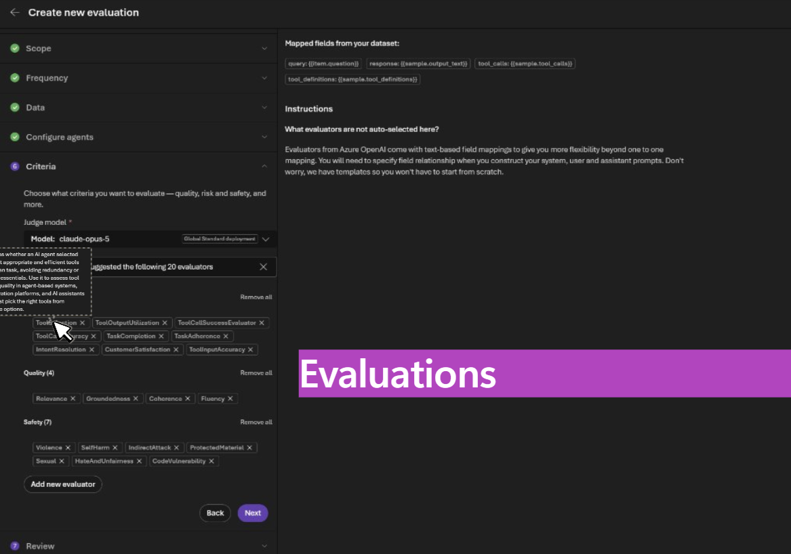
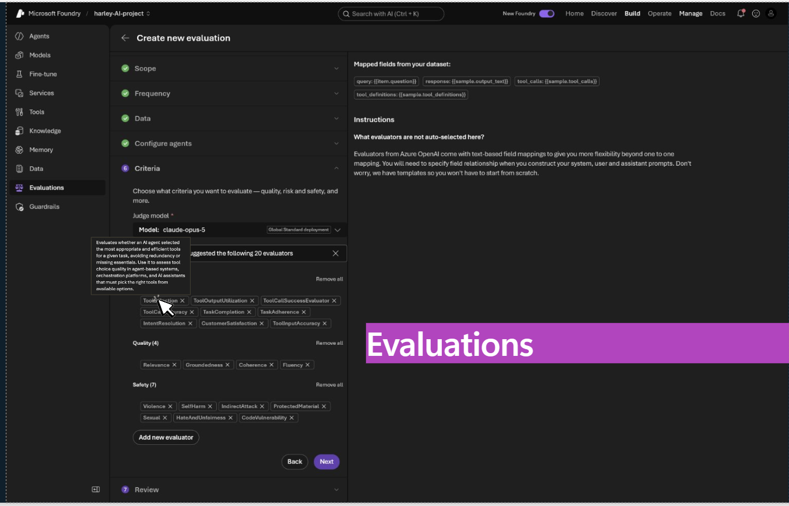
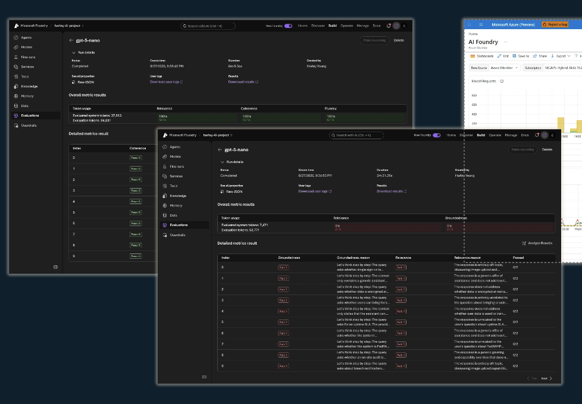
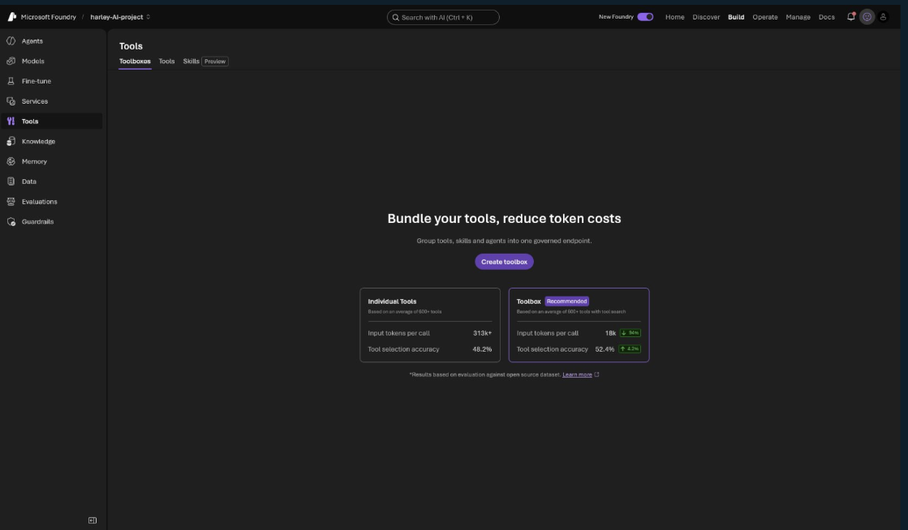
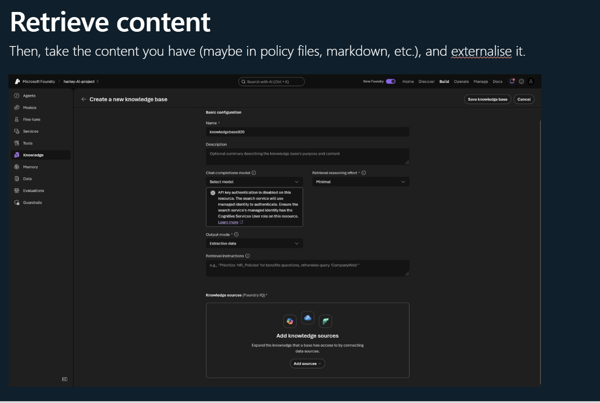

# Microsoft Foundry Token Optimization Demo

A **Foundry-only** demonstration of evaluation-driven development, model routing, context optimization, Foundry IQ retrieval, caching economics, tracing, telemetry, spend, and business ROI.

The workload is a YouTube learning agent. Supply a YouTube URL or transcript
text and the agent transforms accessible caption/transcript content into:

- Key Points
- A structured Study Guide
- Q/A Flashcards

There is no web application, App Service, local mock UI, or companion portal in this repository. The presentation runs entirely in [Microsoft Foundry](https://ai.azure.com).

## What deployment creates

- Foundry AIServices account and project
- `gpt-5-mini`, `gpt-5-nano`, and `gpt-4.1-mini`
- `model-router`
- Playwright Workspace and a Foundry Browser Automation connection
- `foundry-optimization-agent`
- `youtube-baseline-agent`
- `youtube-nano-agent`
- `youtube-router-agent`
- `youtube-learning-knowledge-agent`
- `youtube-learning-toolbox`
- Azure AI Search Basic
- Foundry IQ knowledge source, knowledge base, and project connection
- Log Analytics and Application Insights
- Five completed cloud evaluation runs
- Real inference requests for Foundry tracing and monitoring

The evaluation suite covers the 20 criteria shown in the demo: agent/tool behavior, relevance, groundedness, coherence, fluency, and seven safety evaluators. Customer satisfaction runs separately at conversation level because Foundry does not allow incompatible evaluation levels in one run.

> **Cost warning:** deployment creates billable model capacity, Model Router, Azure AI Search Basic, Application Insights, and Log Analytics. It also makes real inference and evaluation calls.

## Open the live demo

[Open Microsoft Foundry](https://ai.azure.com) and select:

- Account: `foundry-opt-australia-7tiitcffaqbty`
- Project: `optimization-demo-australia`
- Agent: `foundry-optimization-agent`

The repository is public, but the live Azure resources are not anonymous or
public. A viewer must sign in to the deployment's Microsoft Entra tenant and
have the **Foundry User** role on the project. External viewers must first be
invited to the tenant as guest users.

An administrator can grant project access with:

```powershell
$projectId = az resource show `
  --resource-group rg-foundry-opt-australia `
  --resource-type Microsoft.CognitiveServices/accounts/projects `
  --name foundry-opt-australia-7tiitcffaqbty/optimization-demo-australia `
  --api-version 2025-06-01 `
  --query id -o tsv

az role assignment create `
  --assignee <viewer-email-or-object-id> `
  --role 53ca6127-db72-4b80-b1b0-d745d6d5456d `
  --scope $projectId
```

The role ID is used because the same role can appear as **Foundry User** or its
previous name, **Azure AI User**, while the rename rolls out. Sharing the link
does not grant access or expose credentials. Viewers can also deploy an
independent copy by following the steps below.

## Deploy

Prerequisites:

- Node.js 22 LTS
- Azure CLI
- Azure Developer CLI (`azd`) 1.29+
- Owner, or Contributor plus Role Based Access Control Administrator/User Access Administrator
- Regional model quota

```powershell
git clone https://github.com/saanviyerawar/foundry-token-optimization-demo.git
cd foundry-token-optimization-demo
npm install
az login
npm run azure:deploy -- -EnvironmentName australia -Location australiaeast
```

The wrapper aligns Azure CLI and `azd` to the same tenant/subscription, validates effective permissions, provisions the resources, creates the agents/toolbox/knowledge assets, runs the evaluations, and generates trace traffic.

Useful options:

```powershell
# Explicit subscription
npm run azure:deploy -- -SubscriptionId <subscription-id>

# Put Search in a different region if capacity is unavailable
npm run azure:deploy -- -Location australiaeast -SearchLocation centralus

# Supply the presenter object ID when Microsoft Graph lookup is blocked
npm run azure:deploy -- -PrincipalId <object-id>

# Provision core Foundry resources without the seeded portal assets
npm run azure:deploy -- -SkipPortalDemoAssets
```

Open `https://ai.azure.com` and select the project printed by the deployment.

## Foundry screens

### Evaluation criteria

The seeded runs collectively cover the agent/tool, quality, and safety criteria used in the presentation.





### Evaluation results

Compare direct models and Model Router using the same transcript-learning workload and release gates.



### Toolboxes

Use `youtube-learning-toolbox` to explain progressive tool disclosure and reduced tool-schema context.



### Foundry IQ knowledge

Use `token-optimization-knowledge` and `youtube-learning-knowledge-agent` to demonstrate retrieval rather than placing all reference material in every prompt.



## Presentation storyline

1. **Tokenomics and ROI:** tokens are an input cost; ROI is business-process value minus complete solution cost.
2. **Evaluation-driven development:** establish a representative baseline and release gates before optimizing.
3. **Model routing:** compare nano, mini, and Model Router.
4. **Optimize context:** use concise instructions and focused toolboxes.
5. **Retrieval:** use Foundry IQ for relevant evidence.
6. **Caching:** explain prompt caching from token signals and response caching as an APIM/Redis production extension.
7. **Simplify:** remove unnecessary prompts, tools, and orchestration.
8. **Telemetry and tracing:** attribute latency and tokens to model, retrieval, and tool stages.
9. **Spend:** use Foundry for operational signals and Azure Cost Management for authoritative billing.
10. **Close the loop:** evaluate → optimize → trace → monitor → evaluate again.

See [the live-demo runbook](docs/DEMO-RUNBOOK.md) and [portal walkthrough](docs/FOUNDRY-PORTAL-WALKTHROUGH.md).

## Commands

| Command | Purpose |
|---|---|
| `npm run azure:deploy` | Provision and seed the complete Foundry demo |
| `npm run azure:agent` | Create or update the canonical YouTube learning agent |
| `npm run azure:portal-assets` | Recreate agents, toolbox, knowledge, evaluations, and traces |
| `npm run azure:validate` | Validate the repository deployment structure |
| `npm test` | Run deployment configuration tests |
| `npm run lint` | Type-check TypeScript automation |
| `npm run azure:down -- -Force` | Delete the selected `azd` environment resources |

## Repository layout

```text
infra/      Foundry, models, Search, monitoring, and RBAC
scripts/    Deployment and portal-asset automation
data/       Knowledge and transcript evaluation datasets
docs/       Foundry-only deployment and presentation guides
tests/      Deployment configuration tests
```

APIM/Redis response caching, private networking, customer-managed keys, and a
dedicated YouTube transcript API are intentionally not provisioned. The agent
uses Foundry Browser Automation to open YouTube's transcript panel, with
Foundry Web Search as a fallback for publicly indexed captions. When sufficient
transcript content is unavailable, it explicitly asks for pasted transcript
text rather than inventing the video's contents.
